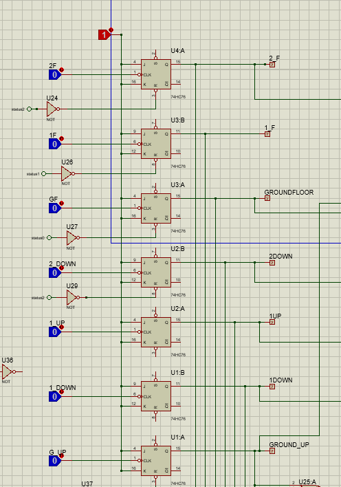
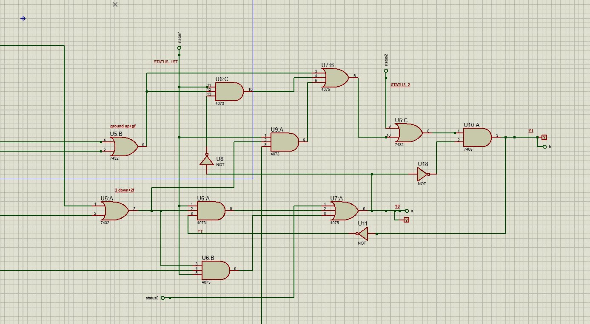
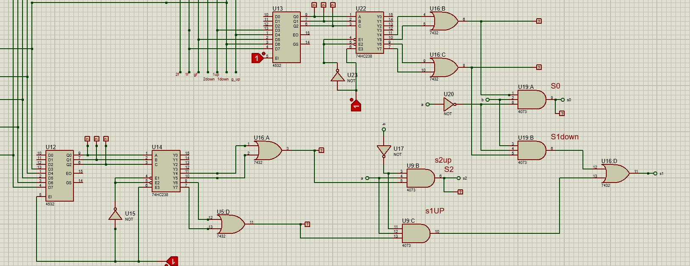
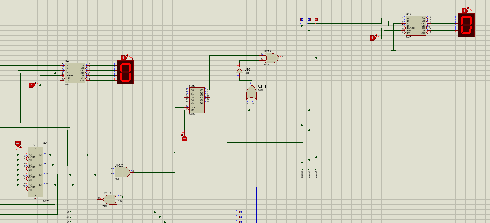
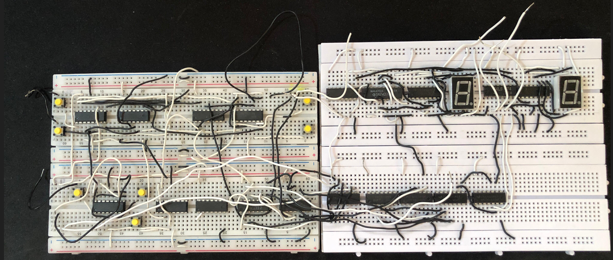
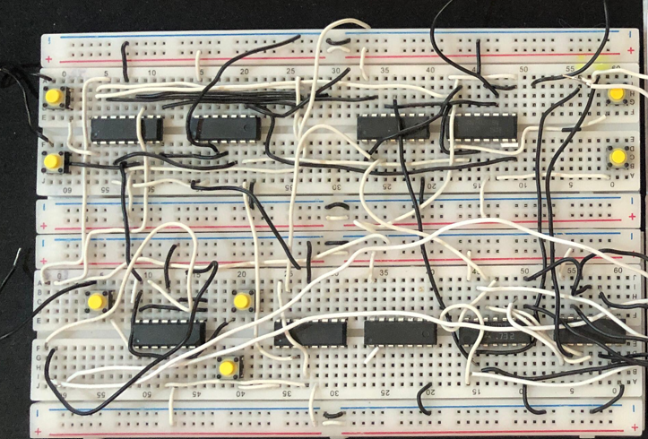
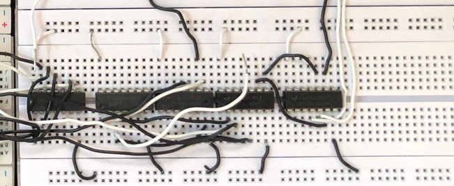
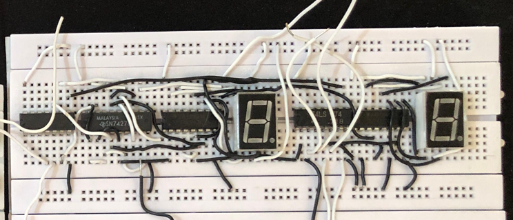

# Elevator Control System

> **Digital Logic Semester Project - Spring 2025**
> By Hadi Aqeel, Jamal Nasir, and Sarmad Malik

## Abstract
Elevators are essential in every high-story building; they act as a practical and familiar system to implement through digital logic. This project serves as a bridge between academic concepts and real-life applications. 

The implementation of this project utilizes a range of different logic gates and ICs commonly used in digital logic. These include simple logic gates (AND, OR, NOT), multiplexers, encoders (7-input priority encoder), and sequential logic circuits (T Flip-Flops, D-type registers, and counters). 

We designed a **3-floor elevator** with movements based on user inputs for both inside and outside the elevator. It provides floor priority based on directional control and elevator position, along with a 10-second delay via a clock for added realism.

## Objectives
- **Main Objective:** Design and implement a multi-floor elevator control system *without* the use of a microcontroller or PLC, strictly utilizing basic digital logic components.
- **Circuit Simulation:** Create and evaluate the elevator control logic using the Proteus simulation program. Verify logic circuits like flip-flops, counters, demultiplexers, and encoders.
- **Hardware Implementation:** Assemble the designed circuit on a breadboard using digital logic ICs, managing multiple Vcc power/ground pins and enable configurations.
- **Request Handling:** Use latching mechanisms for floor/direction requests, and encoders/demultiplexers to rank requests according to position and direction.
- **Display Output:** Use 7-segment displays to output wait time counters and the elevator floor position.

## How it Works
The logic is broken down into several sub-units:
1. **Latching Section:** Captures brief high pulses from button inputs. JK flip-flops toggle to store these requests, holding multiple requests at once until completed.
2. **Directional Control Unit:** Uses logic equations to determine whether the elevator should move up or down, depending on its current floor and active requests. Outputs are generated based on logical flags.
3. **Up/Down Counter:** Every input signal to the encoder is prioritized. Active user requests and the current position of the elevator synthesize a unique binary code through logic gates and a demultiplexer to represent the target floor.
4. **Display Unit:** 7-segment displays show the floor position, while a timer increments a 10-second delay to simulate real-world elevator travel.

## Circuit & Hardware Visuals

### Proteus Simulation Sub-circuits

**1. Latching Inputs (Inside & Outside)**

**2. Direction Control Unit**

**3. Up/Down Counter (Priority Encoder & Demultiplexer)**

**4. Display Unit (Floor & Wait Time)**

### Overall Circuit Simulation (Proteus)

### Hardware Implementation (Breadboard)
**Latching Section with Push Buttons:**

**Overall Breadboard Circuit:**

## Components Used
- **Logic Gates:** 7432 (2-input OR), 4075 (3-input OR), NOT gates, 4073 (3-input AND), 7408 (2-input AND)
- **Flip-Flops:** 74HC76 (JK Flip-Flop), 74174 (D-Type Register), 74276 (Quad JK Edge-Triggered)
- **Encoders/Decoders:** 74HC238 (3-to-8 Decoder/Demux), 4532 (8-input Priority Encoder)
- **Outputs/Inputs:** 7-Segment Displays, Push Buttons

## Conclusion
Through the design and simulation of this elevator control system, we gained a deep, hands-on understanding of how real-world embedded systems problems can be solved using fundamental digital logic components. It demonstrates how complex behaviors—like request handling, direction control, and priority decision-making—can be practically modeled.
